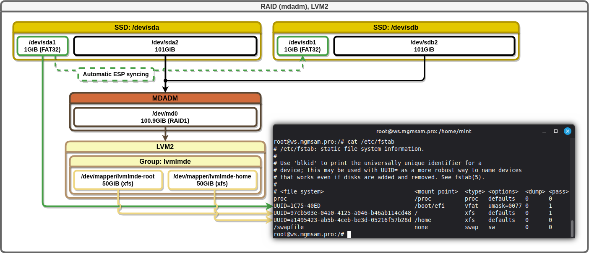
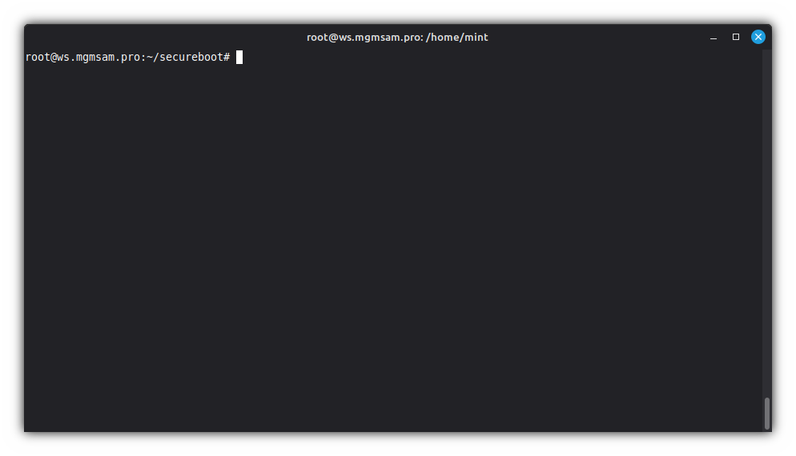

[](COPYING)

# esp-sync

Automatic ESP syncing.

## Description

Automatic ESP synchronization when `iniramfs` is updated to provide fault tolerance in a multi-disk system with multiple ESPs, such as when using software RAID (mdadm).

## Example of use in the Debian 13.2 operating system

Example for syncing two ESPs:



1. Get UUID of the ESPs:

   ```bash
   ESP1_UUID="$(blkid --match-tag UUID --output value /dev/sda1)"
   ESP2_UUID="$(blkid --match-tag UUID --output value /dev/sdb1)"
   ```

2. Check ESP UUIDs:

   ```bash
   echo "ESP1_UUID: $ESP1_UUID"
   echo "ESP2_UUID: $ESP2_UUID"
   ```

3. Create `esp-sync` config:

   ```bash
   cat <<ESP_SYNC.CONF > /etc/initramfs-tools/conf.d/esp-sync.conf
   # Configuration file of the '/etc/initramfs/post-update.d/zz-esp-sync' hook
   # used after creating the initramfs image.

   # Specify the space or comma-separated UUIDs of all ESPs that need
   # to be synchronized with each other.
   # To disable synchronization:
   #   1. The variable can be left empty or commented out;
   #   2. Update the initrd image to add the changed configuration to it;
   ESP_SYNC_UUIDS="$ESP1_UUID, $ESP2_UUID"

   # Specify the mount point of the main ESP partition.
   # Default: /boot/efi
   ESP_MOUNTPOINT="/boot/efi"
   ESP_SYNC.CONF
   ```

4. Create an automatic ESP syncing hook:

   ```bash
   wget --output-document "/etc/initramfs/post-update.d/zz-esp-sync" \
       https://raw.githubusercontent.com/mgmsam/esp-sync/refs/heads/main/esp-sync
   ```

5. Make the initramfs hook executable:

   ```bash
   chmod --verbose u+rwx,go+rx "/etc/initramfs/post-update.d/zz-esp-sync"
   ```

6. Perform a test update of `initramfs`:

   ```bash
   update-initramfs -v -t -u
   ```

   
